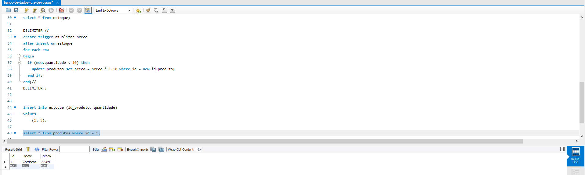

# Talento Cloud Pro - Projeto Criar Base de dados e usar trigger
 ## **Crie um banco de dados, adicione tabelas e determine quais são os atributos de cada uma. Em seguida, execute um trigger que se relacione com algum comando, como insert, select, delete ou update.**

### Trabalhe esse código em seu IDE, suba ele para sua conta no GitHub e compartilhe o link desse projeto no campo ao lado para que outros desenvolvedores possam analisá-lo.

# Demonstração: 

